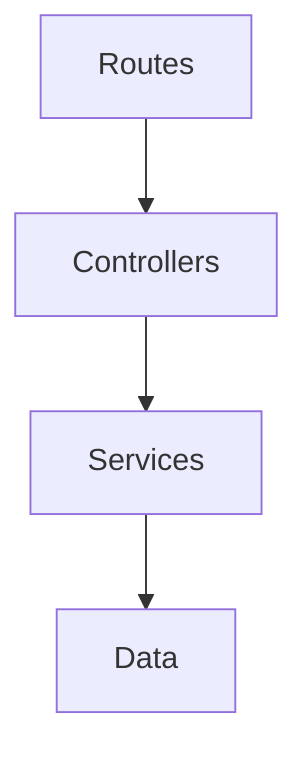

# Arquitectura en capas 

El sistema está diseñado siguiendo una arquitectura en **cuatro capas**, donde cada módulo cumple una responsabilidad específica.  
El flujo de información sigue el orden:

**Routes → Controllers → Services → Data**

---

## Diagrama de capas

