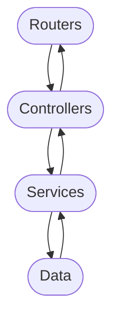

# Arquitectura en capas 

El sistema está diseñado siguiendo una arquitectura en **cuatro capas**, donde cada módulo cumple una responsabilidad específica.  
El flujo de información sigue el orden:

### Routes
- Este modulo se encarga de definir las rutas de la API

### Controllers
- Aqui se reciben las solicitudes de las rutas y se validan los datos

### Services
- Contiene la logica del sitio 

### Data
- Maneja el acceso y la persistencia de los datos